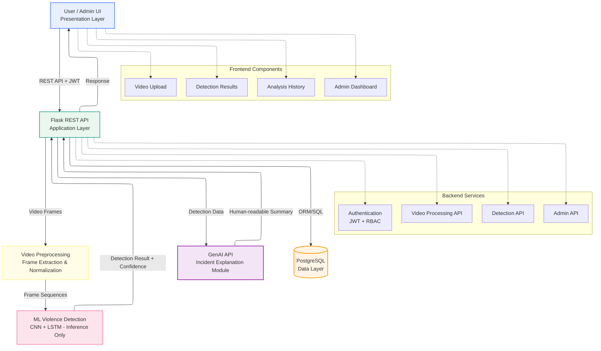

# AI Video Violence Detection System

An intelligent video surveillance system that detects violent activities in short pre-recorded videos using deep learning. The system follows a secure full-stack architecture with role-based dashboards and an inference-only CNN + LSTM model, making it suitable for CPU-only environments. A GenAI module is used to generate human-readable incident explanations after detection.

---

## Features

- Violence detection in 30–60 second video clips  
- CNN + LSTM based inference (no local model training)  
- GenAI-based incident explanation and summarization  
- React.js frontend with User and Admin dashboards  
- Flask-based REST APIs  
- JWT-based authentication and role-based access control  
- PostgreSQL database for persistent storage  
- Offline video analysis (CPU-friendly design)

---

## System Architecture

### Mermaid Diagram (Primary)



> This diagram shows the N-tier flow with authentication, inference-only ML, GenAI-based explanation, and persistent storage.

---

### ASCII Diagram (Fallback)

```
+-------------------+
|   React.js UI     |
| (User / Admin)   |
+---------+---------+
          |
          | JWT + REST APIs
          v
+-------------------+
|   Flask Backend   |
| (Auth & APIs)    |
+----+----------+--+
     |          |
     v          v
+------------+  +---------------------------+
| CNN + LSTM |  | PostgreSQL Database       |
| Inference  |  | (Users, Videos, Results, |
| Only       |  |  Reports)                |
+------+-----+  +---------------------------+
       |
       v
+-------------------+
| GenAI Module      |
| (Incident         |
|  Explanation)     |
+-------------------+
```

---

## Technology Stack

- **Frontend:** React.js
- **Backend:** Python Flask
- **Machine Learning:** TensorFlow (Inference), OpenCV
- **GenAI:** Text-based incident explanation (post-detection)
- **Database:** PostgreSQL
- **Security:** JWT Authentication

---

## GenAI Integration

The system integrates a **GenAI module** as a post-processing layer.
After the CNN + LSTM model detects violence and produces structured outputs (such as confidence score and timestamps), GenAI generates **human-readable incident explanations and summaries**.

GenAI:

- Does **not** process raw video data
- Does **not** participate in detection
- Is used only for explanation and reporting

This design aligns with industry best practices and avoids unnecessary computational overhead.

---

## Project Scope

This project focuses on **offline analysis of short pre-recorded video clips**.

- Deep learning model training is assumed to be performed offline on high-performance systems
- Only inference is executed locally, making the system suitable for CPU-only environments
- The system emphasizes secure access, explainability, and post-analysis monitoring

---

## Project Out of Scope

- Real-time CCTV or live video stream integration
- Weapon detection
- Face recognition
- Edge AI or on-device inference deployment

---

## Target Users

- Students and academic evaluators
- Campus security review teams
- Surveillance system researchers (offline analysis)

---